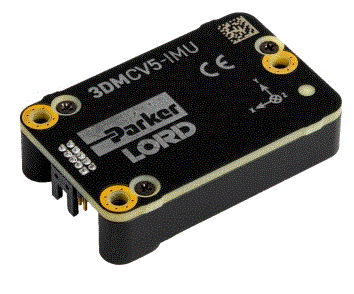

IMU
===

The IMU is the source of the entire pipeline, and it is important because it needs to be accurate *and+ fast, since it determines the maximum frequency of the robot's control algorithm. Most hobby  IMU go up to 100Hz, which is okay, but above that things quickly get expensive. Heavy hearted I went with the [Lord Microstrain 3DM-CV5 IMU](https://www.microstrain.com/inertial-sensors/3dm-cv5-10) which I got from ebay, sometimes these lucky things happen.

.. image:: ../../images/Lord_Microstrain_3DMCV5-IMU.png
	:width: 250
	:alt: Lord Microstrain 3DM-CV5-10

.. image:: /images/Lord_Microstrain_3DMCV5-IMU.png
	:width: 250
	:alt: Lord Microstrain 3DM-CV5-10
